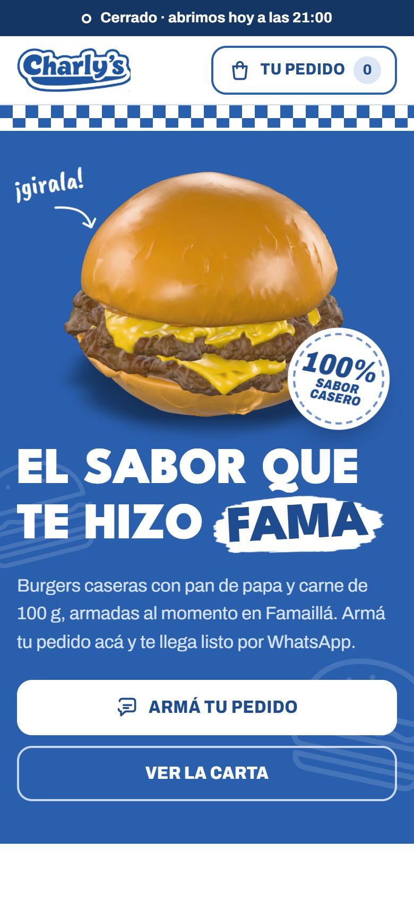
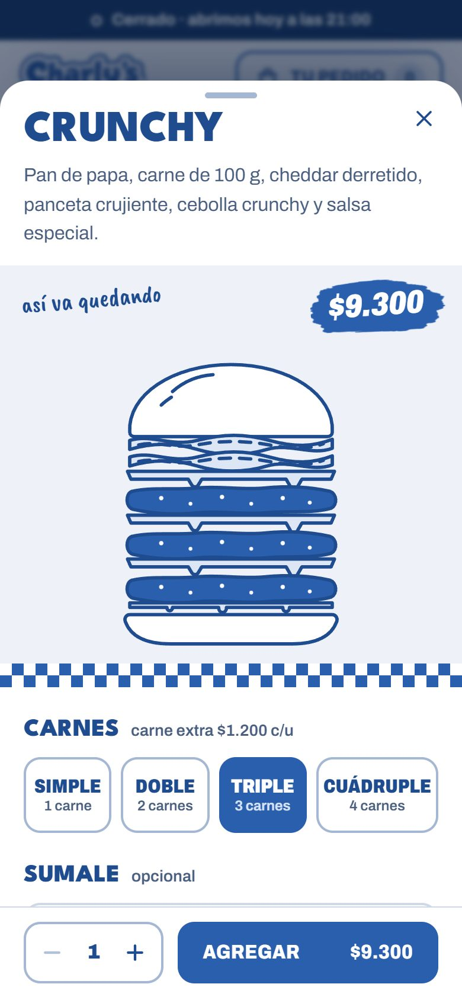
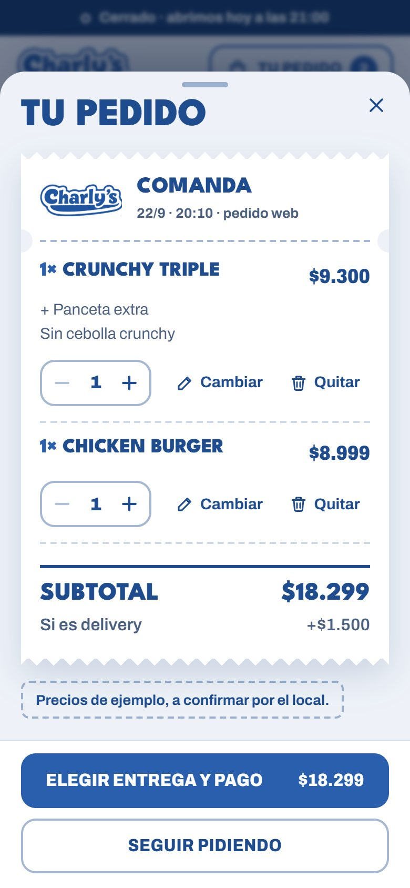
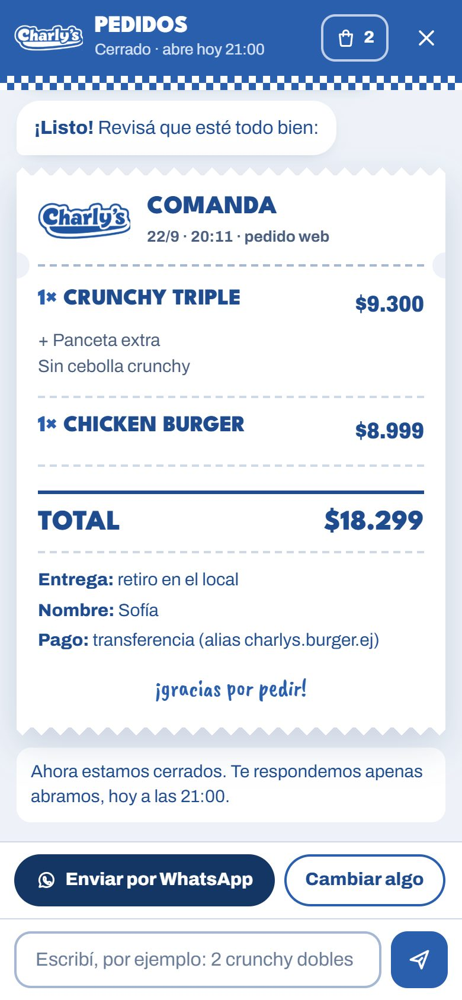

# Charly's · Burgers caseras en Famaillá

Sitio web móvil de **Charly's**, hamburguesería y sandwichería de Famaillá (Tucumán). Muestra la carta, deja armar cada burger a gusto y toma el pedido con un asistente guiado. Al final, el pedido completo llega al WhatsApp del local.

El diseño sale de los flyers de Instagram de [@charlyburgerfama](https://www.instagram.com/charlyburgerfama/): tinta azul sobre papel, cuadrillé, títulos pesados y precios sobre trazos de pincel.

<p align="center">
  
  
  
  
</p>

---

## Qué hace

| | |
|---|---|
| **Burger 3D** | En el inicio hay un modelo 3D que gira solo y se puede girar con el dedo. Mientras carga se ve una foto fija. Si el teléfono tiene ahorro de datos, se queda con la foto. |
| **Carta** | Fotos reales de los productos. Cada burger se arma: simple, doble, triple o cuádruple (carne extra), extras (cheddar, panceta, huevo, cebolla crunchy, salsa), ingredientes para sacar y una aclaración. |
| **Armador** | Un dibujo de la burger que suma o quita capas a medida que elegís. |
| **Carrito** | Tiene forma de comanda de cocina. Se guarda en el teléfono aunque cierres la página. |
| **Asistente de pedidos** | Te guía con botones o entiende texto simple (*"2 crunchy dobles"*, *"papas"*, *"terminar"*). Pregunta delivery o retiro, dirección, nombre y forma de pago, y si pagás en efectivo calcula el vuelto. |
| **Envío por WhatsApp** | Abre WhatsApp con el pedido ya escrito: productos, cambios, total, entrega y pago. |
| **Horario en vivo** | Muestra "Abierto ahora" o "Cerrado · abrimos…" según la hora de Tucumán. Si está cerrado, avisa, pero igual deja armar el pedido. |
| **¿Lo de siempre?** | Repite el último pedido con un toque (se guarda en el teléfono del cliente). |

## Estructura

```
index.html              página
assets/
  menu.js               ⭐ carta, precios, extras, envío, pagos, horario y WhatsApp (lo único que hay que editar)
  app.js                carrito, armador, asistente, horario y envío del pedido
  styles.css            estilos (colores de marca en :root)
  fonts/                tipografías alojadas en el sitio (Archivo, League Spartan, Caveat Brush)
  3d/burger.glb         modelo 3D optimizado (1,7 MB)
img/
  cut/                  recortes de productos, logo en azul y blanco, póster del 3D
  brush/                trazos de pincel sacados de los flyers
  *.jpg, logo.png       fotos y logo originales
docs/                   capturas para este README
PRODUCT.md, DESIGN.md   producto y sistema de diseño
```

No usa frameworks ni hace falta compilar nada: es HTML, CSS y JavaScript. Lo único externo es el visor 3D ([`<model-viewer>`](https://modelviewer.dev/) de Google), que se carga desde jsDelivr después de que la página ya se mostró.

## Verlo en tu compu

El 3D necesita que la página se sirva desde un servidor. Si abrís `index.html` con doble clic funciona todo, pero en lugar del 3D se ve la foto fija.

```bash
# con Python
python -m http.server 8000
# o con Node
npx serve .
```

Después abrí <http://localhost:8000>.

## Antes de publicar ✅

1. **Precios reales:** en `assets/menu.js`, todo lo marcado `// EJEMPLO` es provisorio. Los confirmados son Chicken Burger $8.999, Box Pollo Frito $10.000 y Crunchy doble $7.200.
2. **Envío y pagos:** poné el costo real del delivery (`entrega.delivery.costo`) y los alias reales de transferencia y Mercado Pago (`pagos`).
3. **Sacar el aviso:** cambiá `preciosDeEjemplo: true` a `false` y desaparece el cartel "Precios de ejemplo".
4. **WhatsApp:** si cambia el número, editá `local.whatsapp` en `menu.js` y los links de `index.html` (buscá `5493813690561`).

## Publicar

Es un sitio estático: sirve cualquier hosting (GitHub Pages, Netlify, Vercel, Hostinger).

**GitHub Pages:** en el repo, andá a *Settings → Pages → Build and deployment*, elegí *Deploy from a branch* con la rama `main` y la carpeta `/ (root)`. En uno o dos minutos queda online en `https://eduwavee.github.io/charlyburguer/`.

## El modelo 3D

El modelo original (Meshy AI) pesaba 32 MB, con unos 880 mil triángulos y texturas 4K. Se optimizó con [glTF-Transform](https://gltf-transform.dev/):

```bash
npx @gltf-transform/cli optimize original.glb assets/3d/burger.glb \
  --compress meshopt --texture-compress webp --texture-size 2048 \
  --simplify true --simplify-ratio 0.2 --simplify-error 0.0005
```

Si cambiás el modelo, regenerá también el póster (`img/cut/burger-3d-poster.webp`) con la misma cámara, para que el cambio de foto a 3D no se note.

## Próxima etapa: pedido directo al WhatsApp del local

Hoy el pedido se abre en el WhatsApp del cliente ya escrito, y el cliente toca "enviar". Para que entre solo al chat del local hace falta un pequeño servidor (o una función serverless) conectado a la **API de WhatsApp Business (Cloud API)**. En `assets/app.js`, la función `sendOrder()` es el único punto a reemplazar: ya recibe el pedido completo (productos, entrega, nombre y pago).

## Créditos

- Fotos, logo y flyers: © Charly's (@charlyburgerfama).
- Modelo 3D: generado con Meshy AI para Charly's.
- Tipografías: Archivo, League Spartan y Caveat Brush (SIL Open Font License).
- Visor 3D: [model-viewer](https://github.com/google/model-viewer) (Apache 2.0).
